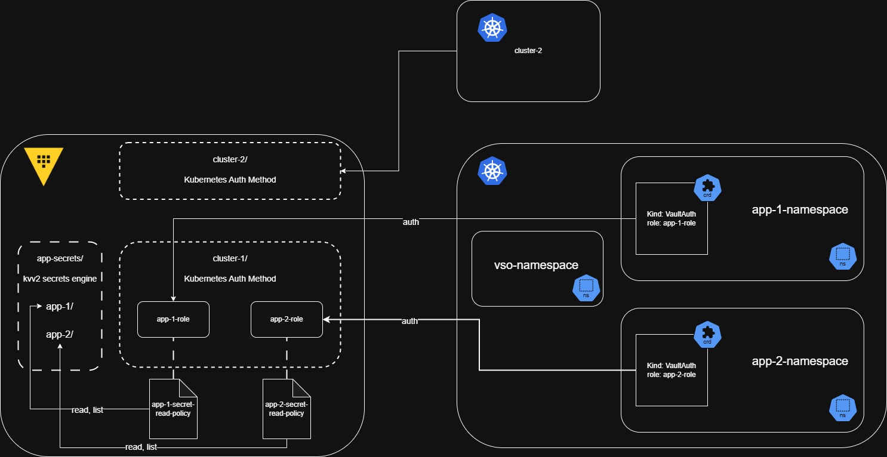

# Kubernetes Secrets Management

# Overview

The lab uses HashiCorp Vault as a central source for secrets management throughout the lab. Kuberentes secrets are sourced from Vault using Vault Secrets Operator (VSO).

## Implementation Overview

- Each kubernetes cluster authenticates to its unique Vault kubernetes authentication method.
- Each namespace in the kubernetes cluster authenticates to a namespace specific role.
- Each namespace's role maps to a policy scoping access to only the required kvv2 secrets.



## VSO Configuration Management and Deployment with FluxCD

VSO deployment is standardized across all kubernetes clusters in the environment using FluxCD. The end goal is that each cluster created has a standardized VSO installed and communicating with its unique Vault kuberentes authentication method.

- A base directory contains the base kustomizations to be applied across all clusters.
- Each cluster has a unique `vault-secrets-operator` kustomization.
- VSO is deployed using the FluxCD CRDs `HelmRepository` and `HelmRelease` that define how the clusters VSO should authenticate to Vault and what role to use in Vault.
- Additionally, each cluster creates a secret containing Vaults CA certificate for VSO to use when communicating with Vault.

```yaml title="HelmRepository and HelmRelease CRDs"
apiVersion: source.toolkit.fluxcd.io/v1
kind: HelmRepository
metadata:
  name: vault-secrets-operator
  namespace: vault-secrets-operator
spec:
  interval: 5m
  url: https://helm.releases.hashicorp.com
---
apiVersion: helm.toolkit.fluxcd.io/v2beta2
kind: HelmRelease
metadata:
  name: vault-secrets-operator
  namespace: vault-secrets-operator
spec:
  chart:
    spec:
      chart: vault-secrets-operator
      version: 0.9.x
      interval: 5h
      sourceRef:
        kind: HelmRepository
        name: vault-secrets-operator
  values:
    defaultVaultConnection:
      enabled: true
      address: "https://vault.lab.com:8200"
      skipTLSVerify: true
      caCertSecret: "vault-ca"
    controller:
      manager:
        clientCache:
          persistenceModel: direct-encrypted
          storageEncryption:
            enabled: true
            mount: lab-dev
            keyName: vso-client-cache
            transitMount: demo-transit
            kubernetes:
              role: cluster-god
              serviceAccount: vault-secrets-operator-controller-manager
              tokenAudiences: ["vault"]
  releaseName: vault-secrets-operator
  targetNamespace: vault-secrets-operator
  interval: 1h
```

Each application namespace additionally contains a `VaultAuth` CRD defining the role to authenticate with. Scoping namespaces to roles mapped to policies provides least privilege to the namespace.

```yaml title="VaultAuth per Namespace"
apiVersion: secrets.hashicorp.com/v1beta1
kind: VaultAuth
metadata:
  name: static-auth
  namespace: uat-test-app
spec:
  method: kubernetes
  mount: lab-dev
  kubernetes:
    role: cluster-god
    serviceAccount: vault-auth
    audiences:
      - https://kubernetes.default.svc.cluster.local
```

A `VaultStaticSecret` CRD is defined for each secret in the namespace to create kuberentes secrets synced to the Vault secret:


```yaml title="VaultStaticSecret per secret"
apiVersion: secrets.hashicorp.com/v1beta1
kind: VaultStaticSecret
metadata:
  namespace: uat-test-app
  name: podinfo-message
spec:
  vaultAuthRef: static-auth
  mount: kv
  type: kv-v2
  path: podinfo
  refreshAfter: 60s
  destination:
    create: true
    name: podinfo-message
```

## RBAC

I am using a Kubernetes ServiceAccount-based authentication flow instead of providing Vault with a long-lived JWT because I do not want to maintain a long lived token. 

- A service account is created per namespace requiring VSO authentication.
- A role is created to permit the renewal of services account tokens.
- The VSO `default` service account is permitted to create tokens for the vault-auth ServiceAccount, allowing it to retrieve and renew Vault authentication.

```yaml title="VSO RBAC Per Namespace"
apiVersion: v1
kind: ServiceAccount
metadata:
  namespace: uat-test-app
  name: vault-auth
---
apiVersion: rbac.authorization.k8s.io/v1
kind: Role
metadata:
  name: vault-auth-token-renew
  namespace: uat-test-app
rules:
  - apiGroups: ['']
    resources: ['serviceaccounts/token']
    resourceNames: ['vault-auth']
    verbs: ['create']
---
apiVersion: rbac.authorization.k8s.io/v1
kind: RoleBinding
metadata:
  name: vso-auth
  namespace: vault-secrets-operator
subjects:
  - kind: ServiceAccount
    name: default
    namespace: vault-secrets-operator
roleRef:
  apiGroup: rbac.authorization.k8s.io
  kind: Role
  name: vault-auth-token-renew
---
apiVersion: rbac.authorization.k8s.io/v1
kind: ClusterRoleBinding
metadata:
  name: vso:vault-auth
roleRef:
  apiGroup: rbac.authorization.k8s.io
  kind: ClusterRole
  name: system:auth-delegator
subjects:
- kind: ServiceAccount
  name: vault-auth
  namespace: uat-test-app
```

